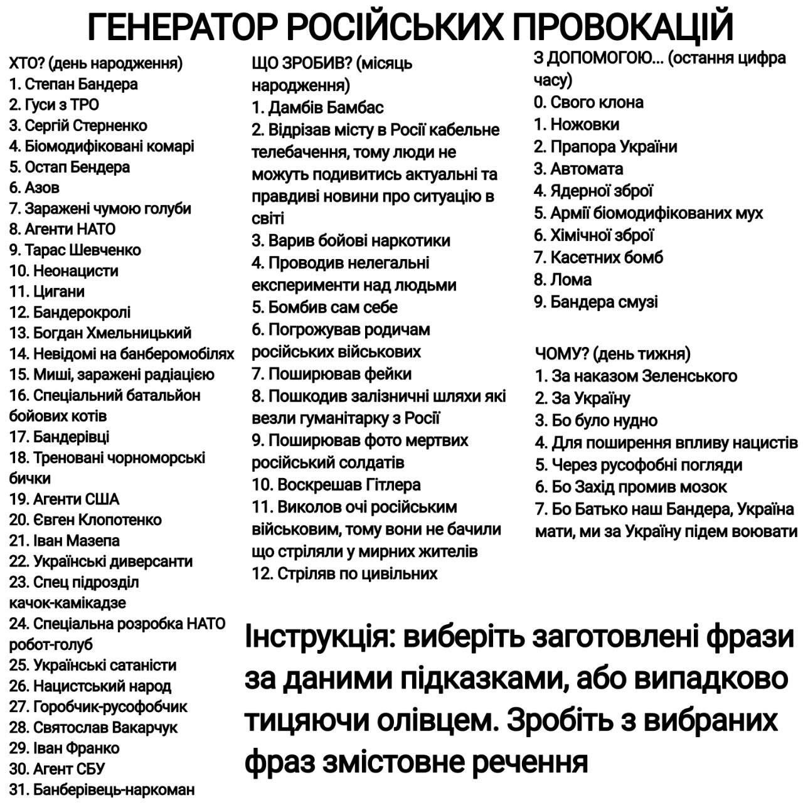

# Why?
### Application for generating the causes of russian aggression

This app randomly generates the reasons for the Russian attack  
The data source is a postironic picture from telegram

## How it works?

App works on React and TypeScript  
How to use app:
1. Download source code
2. Install modules
3. Run *$ npm start*
4. Go to app address

Or just visit [this link](https://roman4i.github.io/why/)
